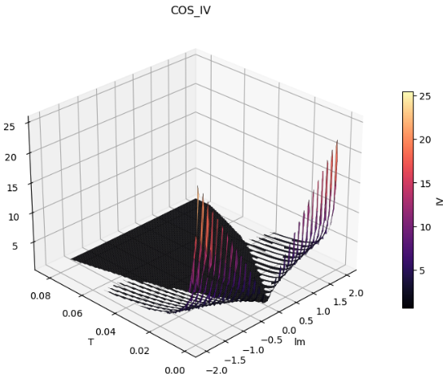
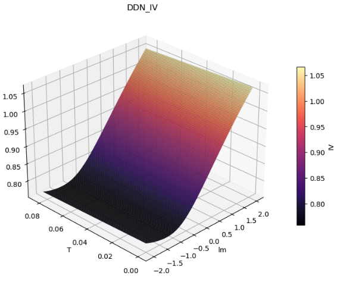

# Neural Network Surrogates for Heston Model Calibration

Deep Differential Networks as fast, arbitrage-free surrogates for semi-analytical option pricing, with gradients stable enough to calibrate against.


> BSc thesis, Chalmers University of Technology (2026) — *Neural Network Surrogates for Optimizing Heston Model Calibration: A Comparative Study on Design Choices for Deep Differential Pricing Surrogates.*

---

### Full Paper: 

[`DML_Heston_full_paper.pdf`](DML_Heston_full_paper.pdf).

The pdf rendering in GitHub is quite bad but downloading should work fine!

## TL;DR

Calibrating the Heston stochastic-volatility model to market data is an expensive inverse problem. You end up pricing thousands of options across strikes and maturities, over and over, with no closed-form price to fall back on. The Fourier-based COS method is the standard semi-analytical tool for this, but it's slow, and its derivatives get numerically shaky in the tails — which is not optimal, since that's exactly where a gradient-based calibrator relies on them.

We train neural networks to replace the pricing engine entirely, and find that how you frame the output matters about as much as the network itself. Our best model, a Deep Differential Network trained on implied volatilities (`DDN_IV`), gives:

- ~764× higher throughput than the COS benchmark (1.23 × 10⁶ samples/s)
- ~440× lower pricing MSE (8.0 × 10⁻⁹ vs. 3.6 × 10⁻⁶ for COS at N=512)
- stable Greeks in the extreme tails, where both price-trained networks and COS do poorly
- near-zero arbitrage violations (arbitrage-free on most criteria)

The idea behind `DDN_IV`: predict implied vol and map back to price through Black–Scholes. The surrogate then inherits the guarantees built into the pricing formula, and sidesteps the numerical singularities COS runs into at low vega.

---

## Background

The Heston model captures volatility clustering and the volatility smile by modelling variance as a mean-reverting stochastic process. That realism comes at a price: option values have to be recovered numerically, so calibration, finding the parameters (κ, θ, σ, ρ, v₀) that reproduce observed prices, becomes a computational bottleneck. In latency-sensitive settings like real-time risk or high-frequency trading, that bottleneck is a real problem.

Surrogate modelling swaps the numerical pricer for a trained network. Pricing then collapses to a single forward pass at 𝒪(1) inference cost, and because the network is differentiable, a calibration optimizer can read parameter gradients straight off it rather than estimating them with finite differences.

## Approach

### Differential machine learning (DML)

Instead of fitting prices on their own, the differential networks are trained with a Sobolev loss: the exact parameter derivatives (the Greeks) are added as extra supervision targets. This acts as a strong regularizer — it teaches the network the shape of the pricing manifold, not just its value at each point, and that's what makes the learned gradients trustworthy enough to calibrate against.

### Data pipeline

- **Sampling** — Heston parameters and market state (maturity, rate, log-moneyness) are drawn with Sobol sequences, for low-discrepancy coverage of the 8-dimensional input space.
- **Ground truth** — prices and exact parameter Greeks are computed with the COS method, implemented in JAX so the Greeks come from automatic differentiation instead of finite differences.
- **IV targets** — implied volatilities and IV Greeks come from Jäckel's "Let's Be Rational" algorithm, which inverts Black–Scholes robustly and avoids the divergence you can get from Newton–Raphson.

### The four surrogates compared

| Model | Target | Idea |
|-------|--------|------|
| `MLP_P` | Price | Standard supervised baseline — no Greeks, no DML |
| `DDN_P` | Price | Differential network on raw prices + Greeks |
| `DDN_PdivK` | Price / Strike | Normalizes the price scale into a bounded [0, 1] target |
| `DDN_IV` | Implied vol | Predicts IV, prices via Black–Scholes |

All four use SiLU activations (smooth and continuously differentiable, which matters for clean Greeks) and a Softplus output head so predictions stay non-negative.

## Results

Everything below is measured on a held-out test set, against COS with N = 512 expansion terms.

| **Metric**                   | **MLP_P** | **DDN_P** | **DDN_PdivK** | **DDN_IV**    | **COS**   |
| ---------------------------- | --------- | --------- | ------------- | ------------- | --------- |
| Speedup vs. COS              | 323×      | 687×      | 664×          | **764×**      | 1×        |
| Pricing MSE                  | 1.76×10⁻⁷ | 1.94×10⁻⁸ | 1.19×10⁻⁸     | **8.04×10⁻⁹** | 3.55×10⁻⁶ |
| Price-bound violations       | 2.77%     | 2.47%     | 2.20%         | **0.00%**     | 1.18%     |
| Calendar-spread violations   | 2.83%     | 1.92%     | 2.27%         | **0.31%**     | 1.21%     |
| Average Directional Accuracy | 95.50%    | 96.99%    | 97.22%        | **99.58%**    | 98.57%    |

### Seeing the difference

<p align="center">
  
  
</p>

<p align="center"><em><b>Left — COS.</b> Inverting COS prices back to implied vol at short maturities blows up in the low-vega wings: IV spikes past 20 where the numerical integration loses precision. <b>Right — DDN_IV.</b> The surrogate learns a smooth, bounded volatility surface across the whole domain, the same robustness that keeps its arbitrage violations near zero.</em></p>

A few things stood out:

- **Output representation matters most.** The plain MLP is the weakest network by a clear margin. Differential training helps, but the big jump in accuracy, stability, and arbitrage compliance comes from reframing the target as implied volatility.
- **Errors are more uniform.** Price-trained models have errors that grow with option magnitude, so they're biased toward in-the-money contracts. `DDN_IV`'s errors stay roughly flat across the domain.
- **The tails hold up.** Using an empirical Lipschitz analysis (Monte Carlo over 20k pairs), the differential networks damp the high-frequency artifacts COS produces in low-vega regions — `DDN_IV`'s 99th-percentile sensitivity ratio for κ is 0.41× that of COS.
- **Extrapolation is graceful.** Out of distribution, `DDN_P` and `MLP_P` diverge and can even return invalid negative Gamma, while `DDN_IV` degrades sensibly past its training bounds.

For the full breakdown — Lipschitz analytics, error heatmaps, and the assumptions behind each claim — see [`project_information.md`](project_information.md).

## Repository structure

```
.
├── notebooks/
│   ├── 1_data_generation/     # Sobol sampling, COS+JAX ground truth, IV transform, arbitrage post-processing
│   ├── 2_model_training/      # One notebook per surrogate (MLP_P, DDN_P, DDN_PdivK, DDN_IV, ...)
│   └── 3_evaluation/          # final_eval.ipynb — the full benchmark
├── src/heston_project/
│   ├── pricing/
│   │   ├── COS_nojax.py                # Reference COS implementation
│   │   └── COS_with_jax_gradients.py   # JAX COS → exact Greeks via autodiff
│   ├── models/
│   │   ├── DDN.py             # Deep Differential Network
│   │   ├── MLP.py             # Baseline MLP
│   │   └── saved/             # Trained checkpoints (.pth)
│   └── utils.py              # Parameter bounds & input/target scaling
├── tests/                    # COS validation, Sobol-vs-LHS study, "Let's Be Rational" checks
├── data/                     # Datasets available on request (see data/info.md)
└── pyproject.toml
```

## Getting started

```bash
git clone https://github.com/mans-westman/DML-HestonCalibration.git
cd DML-HestonCalibration

python -m venv .venv && source .venv/bin/activate
pip install -e .          # installs the heston_project package
```

Then work through the notebooks in order — `1_data_generation` → `2_model_training` → `3_evaluation`. The pretrained checkpoints in `src/heston_project/models/saved/` let you reproduce the evaluation in `notebooks/3_evaluation/final_eval.ipynb` without retraining. The synthetic datasets are large and are available on request (see [`data/info.md`](data/info.md)).

## Tech stack

PyTorch (surrogate training) · JAX (differentiable COS pricer / exact Greeks) · NumPy / SciPy · Sobol sequencing · "Let's Be Rational" for implied-vol inversion.

## Authors

Alex Andersson · Linnea Davidson · Markus Eliassen · Jacob Hansén · Isak Stridh · Måns Westman
Bachelor's thesis, Chalmers University of Technology, 2026.

## License

Released under the [MIT License](LICENSE).
